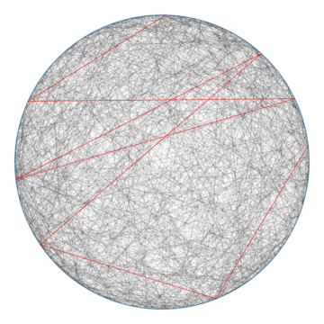

# b3-r7-r4nd7

This is my solution for the coding challenge of https://get-in-it.de and Bertrand.
The challenge is located here: https://www.get-in-it.de/coding-challenge



## What is it about?

The task was to find the shortest path from the planet `Earth` to the planet `b3-r7-r4nd7`.
The challenge organizers provided a `json` encoded file with all necessary data.
This file consists of 1000 nodes. This data forms an undirected graph with 
edges with different cost.

## Ok, how to solve it?

During my computer science studies I learned, that the best way to solve the shortest-path
problem in undirected graphs is the `single-source shortest-path` Algorithm from Dijkstra.
I would have preferred solving this problem with `Golang`, but in the end I have decided,
that `Python` would be a better deal for this, because of various reasons. The main reason
was simply that the challenge organizers wanted `Java`, `Javascript`/`Typescript`, `C++`, 
or `Python`. So at first I wanted to use `C++`, but the time investment would have been
too huge. So I picked `Python` for the fastest way to get a working prototype.
For the solution I have used a Dijkstra `A*` implementation.
So the only thing I would need to care about was reading the `Json` file, 
streaming the data into my graph, doing some testing and generating a nice image of my path.

## How to run this code

First of all you need to download all requirements including `Python3`. 
`Python2` will be deprecated in 2020, so **please do not use it**.
These requirements are defined in my `requirements.txt` file.
You can install all necessary requirements via:

`$ pip install -r requirements.txt`

I suggest you install those requirements in an own development environment, 
called `virtualenv`. There are plenty of tutorials in the internet for this,
so I don't get into this in more detail.

If you have all requirements you can run the small program with the following command:

`$ python3 challenge.py`

This will print the following help:

```
usage: challenge.py [-h] [--statistics] [--graphic]

Find the shortest path for the get-in-IT/bertrand challenge

optional arguments:
  -h, --help        show this help message and exit
  --statistics, -s  Print statistics in ASCII
  --graphic, -g     Generate statistics as PDF format
```

## The solution

Here is the solution for the challenge:
```
------ Statistics ------
Shortest path: 18 <--> 810 <--> 595 <--> 132 <--> 519 <--> 71 <--> 432 <--> 246
Edge costs   : [0.04060214221510905, 0.1628038931266662, 0.6331384762650787, 0.6333618615566976, 0.7625760415706333, 0.6742157893614655, 0.08898969190380779]
Total cost   :  2.995687895999458
------------------------
```
